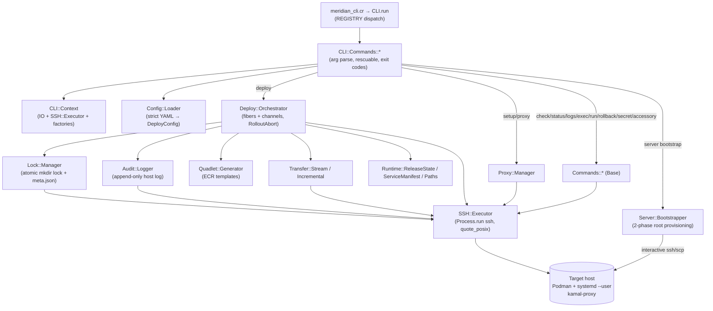

# Meridian Pre-0.1.0 Audit

> Audit date: 2026-06-26 · Audited revision: `6b2848f` (branch `main`, working tree clean)
> Toolchain on audit machine: Crystal 1.20.2, Podman 5.6.2 (podman machine), Lima 2.x, macOS (arm64).
> Method: full source read (`src/` ≈ 8.6k LOC, `spec/` ≈ 11.2k LOC), local build/test/lint/format,
> CLI smoke tests, config-validation tests, and a live Quadlet container-lifecycle test in the local
> Podman VM. No remote/production systems were touched. The only file created by this audit is this
> document.

---

## 1. Executive Summary

**Verdict: `NOT READY` (close — one real correctness blocker, then `READY WITH CONDITIONS`).**

Meridian is a genuinely well-built project for its stage. The architecture is clean and consistent
(dependency injection everywhere, strict YAML config, ECR Quadlet templates, fiber/channel
orchestration, injectable fakes for tests). The test suite is green (570 examples, 0 failures), the
linter and formatter are clean, there are **zero runtime dependencies**, the SSH command layer is
correctly quoted against injection, and secrets are handled via stdin (never argv, never logs). The
user-facing reference docs (`docs/reference/deploy-yml.md`) are accurate down to the caveats. The
README is honest ("Don't run this in production yet").

What prevents tagging `0.1.0` today is **one verified correctness bug in a documented core feature**:

- **`meridian rollback` does not work after a normal deploy.** A blue/green deploy stops the old
  colour, and Quadlet *removes* the container on stop (verified: generated unit contains `--rm`,
  `ExecStop=podman rm -f`, `ExecStopPost=podman rm -f`). `rollback` then calls `podman start` on a
  container that no longer exists and fails with *"Rollback target … is not present"*. The unit
  specs pass only because the fake SSH runner reports the container as present. This is a trap: the
  command fails exactly when an operator reaches for it during an incident.

Importantly, the **safety net for *failed* deploys is intact**: the old colour is stopped only after
a successful health check and proxy switch, so a failed health check leaves the previous version
serving traffic with no downtime. The gap is specifically in *intentional rollback of a
successful-but-bad release*.

Beyond that, three P1 issues should be fixed (or consciously accepted) before tagging: a deploy can
**hang forever** if a `files:` source is missing or an accessory's readiness can't be inferred
(unhandled exception inside a host fiber); the **macOS release binaries are not self-contained**
(they link Homebrew dylibs); and **blue/green is hardcoded to the literal role name `web`** while the
config and docs imply any role with `proxy:` is proxied.

Overall risk: **Medium.** No data-loss or remote-code-execution defect was found. The blockers are
correctness/operability issues with clear, bounded fixes. With MER-AUDIT-001 resolved (or the
command removed) and the P1 set addressed, Meridian is a credible, honestly-scoped `0.1.0` preview.

**Recommended next action:** Fix or remove `rollback` (MER-AUDIT-001), make host-fiber failures
non-hanging (MER-AUDIT-002), and ship the macOS binaries with bundled libs or a documented
dependency (MER-AUDIT-003). Then run the existing E2E recipes once against a real VM with a rollback
step added.

| Severity | Count |
| --- | --- |
| P0 – Release blocker | 1 |
| P1 – Fix before 0.1.0 | 3 |
| P2 – Soon after 0.1.0 | 12 |
| P3 – Later / nice-to-have | 7 |

---

## 2. Recommended Scope for 0.1.0

This scope is **interpreted** from README, `docs/`, the CLI registry (`src/meridian.cr`), the schema
(`src/config/loader.cr`), `pre-0.1.0-requiremnts.md`, and the E2E fixtures. The pre-0.1.0 plan
document confirms the intended cut line (tickets 085 + 088 + docs/release), and ticket 085 ("role-named
units for non-proxied roles") landed as the audited HEAD commit.

**Core features that should be supported and honestly described:**

- Rolling, batched deploy of a proxied `web` role with blue/green cutover via a shared host-level
  kamal-proxy, plus secondary (non-proxied) roles deployed as restart-in-place `<service>-<role>`
  units after the first web host succeeds.
- Three image-transfer modes: registry pull (default), `stream` (`podman save | zstd | ssh`), and
  `incremental` (OCI layout + rsync + skopeo).
- Podman secrets managed remotely (`secret gen/set/rm/ls`), values via stdin.
- `server bootstrap` (root-phase provisioning), `setup` (service + proxy networks + kamal-proxy),
  `check` (read-only preflight), `plan` (resolved-config dump), `status`, `logs`, `exec`, `run`,
  `accessory start/stop/logs`, `quadlet`, `proxy`, `lock`, `audit`.
- Accessories with a readiness gate on the service network; built-in fingerprinted asset hosting via
  a Caddy sidecar.
- Multi-app-per-host coexistence guarded by manifest collision detection (currently in `check`).

**Supported platforms (recommended to state explicitly):**

- *Operator (where Meridian runs):* Linux and macOS, x86_64 and arm64. **Caveat:** the macOS
  binaries currently require matching Homebrew libs (MER-AUDIT-003).
- *Target servers:* Debian/Ubuntu (the `server bootstrap` script is `apt`-specific), Podman 4.4+,
  systemd with rootless `--user` services and lingering enabled.

**Deliberately excluded / experimental (state plainly):**

- `build:` — reserved, validated-as-unsupported. No `meridian build`; bring your own image. (Already
  documented correctly.)
- `meridian up` composite (ticket 055) — intentionally deferred post-0.1.0.
- Standalone bootstrap, role-scoped unit renames, timers (tickets 053, 057–066) — deferred.

**Known limitations to document for 0.1.0:**

- Only a role literally named `web` is proxied/blue-green; exactly one proxied role is supported.
- `rollback` is web-role only (and currently broken — MER-AUDIT-001).
- No native TLS/proxy; depends on kamal-proxy. Config format is not frozen.

---

## 3. Architecture Overview

**Main components and control flow**

**Deploy sequence (proxied web host, `zero_downtime_deploy_to_host`, orchestrator.cr:156):**
acquire remote lock → (per host fiber) require service network → transfer image → write Quadlet for
the inactive colour → daemon-reload → wait for co-network accessories → start new colour → poll
container health from a pinned probe sidecar (N consecutive successes) → `kamal-proxy deploy` (atomic
switch) → stop old colour → remove old Quadlet → record active colour / release-state / manifest →
prune images → release lock. Secondary roles start after the first web host succeeds.

**External dependencies:** system `ssh` (and `scp` during bootstrap); on hosts: `podman`, `systemd`,
`kamal-proxy` (container), and per transfer mode `zstd` / `rsync` / `skopeo`; the pinned probe image
`docker.io/library/alpine:3.21`; the pinned proxy image `docker.io/basecamp/kamal-proxy:v0.9.2`.

**State and failure boundaries:**

- Per-service runtime state under `~/.local/state/meridian/services/<service>/`
  (`active-color`, `release-state.json`, `manifest.json`, `lock/`, `audit.log`); a legacy
  `.config/containers/systemd/.meridian-color` is also written for older CLIs.
- The deploy lock is a single remote directory (`mkdir`-atomic) on the first web host; held for the
  whole deploy, released in an `ensure`.
- Each host deploy is a fiber; results flow back over a buffered channel; `RolloutAbort` (mutex)
  signals other roles/batches to stop. **Boundary gap:** only `DeployFailed` is converted to a
  channel result inside the fiber (MER-AUDIT-002).

---

## 4. Checks Performed

| Check | Command / Method | Result | Note |
| --- | --- | --- | --- |
| Build (debug) | `bin/meridian` present, rebuildable | Pass | Builds clean on Crystal 1.20.2 |
| Test suite | `crystal spec` | **Pass** | 570 examples, 0 failures, 0 errors, 0 pending (236 ms) |
| Format | `make format_checks` | Pass | clean |
| Lint | `make lint` (ameba) | Pass | 91 files, 0 failures |
| Version | `meridian --version` / `-v` | Pass | prints `0.1.0` (from `shards version` macro) |
| Top help / unknown cmd / unknown flag | `meridian` / `meridian frobnicate` / `meridian --x` | Pass | exit 0 / 1 / 1 with messages |
| Config (valid) | `meridian plan --config valid.yml` | Pass | resolved plan, exit 0 |
| Config (unknown nested key) | `plan` on `proxy.hostt` | Pass | `Unknown config key: servers.web.proxy.hostt`, exit 1 |
| Config (missing required) | `plan` without `image` | Pass | `Missing required config key: image`, exit 1 |
| Config (bad transfer mode) | `plan` with `mode: ftp` | **Weak** | opaque `Couldn't parse (…TransferConfig | Nil)`, exit 1 (MER-AUDIT-005) |
| Config (no web role) | `plan` on workers-only | **Gap** | exit 0; deploy would fail late (MER-AUDIT-004) |
| Missing config file | `plan --config nope.yml` | Weak | raw `Error opening file …`, exit 1 (MER-AUDIT-013) |
| Fiber failure semantics | isolated Crystal repro | **Confirms bug** | unhandled spawn exception → `channel.receive` blocks forever (MER-AUDIT-002) |
| Quadlet stop lifecycle | live test in Podman VM | **Confirms bug** | container removed on `systemctl --user stop` (MER-AUDIT-001) |
| Quadlet generated unit | `systemctl --user cat` in VM | **Confirms bug** | `--rm` + `ExecStop=podman rm -f` + `ExecStopPost=podman rm -f` |
| macOS linkage | `otool -L bin/meridian` | **Gap** | links `/opt/homebrew/opt/{libyaml,pcre2,bdw-gc}` (MER-AUDIT-003) |
| Repo hygiene | `git ls-files` | Pass | 206 tracked files; all build artifacts gitignored |
| Dependencies | `shard.lock` | Pass | only ameba (dev), commit-pinned; zero runtime shards |
| E2E (rollback) | grep `scripts/ e2e/` | **Gap** | E2E never exercises rollback; only faked unit specs |

---

## 5. Release Blockers (P0)

### MER-AUDIT-001 — `rollback` is non-functional after a normal deploy

A blue/green deploy stops the previously-active colour (`orchestrator.cr:221-227`) and deletes its
`.container` file. Quadlet **removes the container on stop** — verified live: after
`systemctl --user stop`, `podman container exists` returns false, and the generated unit contains
`ExecStart=… --rm …`, `ExecStop=/usr/bin/podman rm -v -f -i …`, `ExecStopPost=-/usr/bin/podman rm …`.
`Commands::Rollback` then requires the previous colour's container to still exist
(`rollback.cr:34-38`) and calls `podman start <previous>` (`rollback.cr:77`), so it always raises
*"Rollback target `<service>-<colour>` … is not present on `<host>`"*. The rollback specs pass only
because `FakeSSHRunner` reports the container as present, so this never surfaced in CI. See §9 for
full detail and fix options. **Recommendation: fix or remove the command before tagging.**

---

## 6. Fix Before 0.1.0 (P1)

- **MER-AUDIT-002 — Deploy hangs forever on a non-`DeployFailed` exception inside a host fiber.**
  Verified. A missing `files:` source (`File::NotFoundError` from `@file_reader`,
  `orchestrator.cr:875`) or an accessory whose readiness can't be inferred (`Config::ValidationError`
  from `effective_ready`, reached via `wait_for_accessory`, `orchestrator.cr:508`) escapes the per-host
  `spawn` (which only rescues `DeployFailed`, `orchestrator.cr:644-651`). The fiber dies; the
  buffered `batch_result_channel.receive` (`orchestrator.cr:655`) blocks forever; the held deploy
  lock is never released; there is no signal handler, so Ctrl-C leaves a stale lock. Neither `check`
  (no `files` existence probe) nor `plan` (rescues readiness to `UNRESOLVED`, exit 0) prevents it.

- **MER-AUDIT-003 — macOS release binaries are not self-contained.** `otool -L` shows the binary
  links `/opt/homebrew/opt/libyaml/lib/libyaml-0.2.dylib`, `…/pcre2/…/libpcre2-8.0.dylib`,
  `…/bdw-gc/…/libgc.1.dylib`. The release workflow (`release.yml`) builds macOS with the same
  non-static `crystal build`, so artifacts hardcode the runner's Homebrew prefix (arm64
  `/opt/homebrew`, Intel `/usr/local`). A user downloading the binary without those formulae gets a
  dyld *"Library not loaded"* failure. Meridian's whole pitch is "deploy from your laptop," so macOS
  matters.

- **MER-AUDIT-004 — Blue/green is hardcoded to the literal role name `web`; `proxy:` on any other
  role is silently mishandled.** `deploy_host` only takes the zero-downtime path when
  `role == "web" && server.proxy` (`orchestrator.cr:689`); `ordered_secondary_roles` rejects `"web"`
  (`orchestrator.cr:697`); `ServiceManifest.from_config` and `check` only read `servers["web"]`. A
  managed non-`web` role with a `proxy:` block passes validation (`loader.cr` only rejects proxy when
  `managed: false`), joins the proxy network in its generated Quadlet, but is deployed via
  stop/start with **no kamal-proxy route registration and no blue/green** — a half-configured, broken
  deploy. The reference doc states "With `proxy:`, Meridian deploys colour-named … units", implying
  any role with `proxy:` is proxied. A config with no `web` role passes `plan`/`check` but
  `deploy` raises `Unknown role: web` *after acquiring the lock*.

---

## 7. Plan After 0.1.0 (P2)

- **MER-AUDIT-005** — Invalid `transfer.mode` yields an opaque `Couldn't parse (…TransferConfig | Nil)`
  instead of the intended *"Unknown transfer mode: ftp, expected one of: registry, stream,
  incremental"*; the helpful `TransferModeConverter` message is masked and untested.
- **MER-AUDIT-006** — Multi-app manifest collision detection runs only in `check`
  (`check.cr:274`), not in `deploy`. Two colliding services deployed directly can clobber each
  other's proxy routes; the safety is opt-in.
- **MER-AUDIT-007** — Quadlet templates interpolate `env.clear` values, `cmd`, volumes, and ports
  unescaped (`container_file.ecr:15,27`). A value with whitespace or a newline produces a broken
  unit or injects a directive. Author-controlled, but a surprising footgun.
- **MER-AUDIT-008** — `setup` creates the proxy `data_dir` via `sudo install -d …` with no `-n` and
  no TTY (`proxy/manager.cr:42`). It works only because `server bootstrap` defaults to passwordless
  sudo; a `--no-passwordless-sudo` host makes `setup` fail with an opaque sudo error. Undocumented.
- **MER-AUDIT-009** — `deploy`/`status`/`logs`/`exec`/`rollback` do not set `BatchMode=yes` (only
  `check` does, `check.cr`). Without loaded keys, ssh can prompt/stall instead of failing fast;
  behaviour is inconsistent with `check`.
- **MER-AUDIT-010** — No SIGINT/SIGTERM handling. An interrupted deploy leaves the remote lock held.
  Recovery (`lock release`) is documented, but a signal handler that releases the lock would be safer.
- **MER-AUDIT-011** — `secret set/gen/rm/ls` default to `--role web` (`secret.cr:67`). A global
  `env.secret` used by multiple roles on different hosts must be set per role/host; easy to miss.
  `check` does catch a missing secret, which mitigates it.
- **MER-AUDIT-012** — `rollback` reverts only the `web` role; secondary roles are not rolled back
  (`rollback.cr:7`). (Blocked behind MER-AUDIT-001.)
- **MER-AUDIT-013** — Missing config file and "run outside a project" surface raw Crystal
  `Error opening file with mode 'r': '.meridian/deploy.yml'` rather than an actionable message.
- **MER-AUDIT-014** — `deploy.guideline.yml` (marked dev-only, but in the repo) contradicts the real
  schema and implementation: `response_buffer`, `replicas`, `pre_build`/`deploy_failed` hooks, a
  working `build:`, secrets described as an `/etc/meridian/<service>.env` EnvironmentFile (actual:
  Podman secrets), and "tag is always the git SHA" (no such tagging exists). Misleading; remove or fix.
- **MER-AUDIT-015** — README/`deploy-yml.md` say unresolved accessory readiness "fails at `meridian
  plan`/`deploy`"; `plan` actually prints `UNRESOLVED` and exits 0 (`deploy/plan.cr:185-189`), and
  `deploy` hangs (MER-AUDIT-002) rather than failing cleanly.
- **MER-AUDIT-016** — No `CHANGELOG.md`; the release relies solely on GitHub auto-generated notes.

---

## 8. Later Improvements (P3)

- **MER-AUDIT-017** — `incremental_oci_directory` is a predictable `/tmp/meridian-oci/<service>`
  (`runtime/paths.cr:41`), used both locally (`FileUtils.rm_rf` + mkdir) and on the remote. On
  shared machines this is a classic predictable-/tmp symlink/ownership risk. Prefer a per-user
  state/cache dir.
- **MER-AUDIT-018** — Release/workflow third-party Actions are pinned to mutable major tags
  (`@v4`, `@v3`, `@v2`, `@v1`) rather than commit SHAs. Supply-chain hardening.
- **MER-AUDIT-019** — Accessory names are not validated (unlike `service`). They are interpolated
  into inner `sh -c "until nc -z <name> …"` strings (`orchestrator.cr:537-543`, `check.cr:200-214`).
  Author-controlled, so not a privilege boundary, but names with shell metacharacters break the probe;
  validate them like service names.
- **MER-AUDIT-020** — `Config::Loader` parses YAML twice (a hand-rolled walker for path-qualified
  unknown-key errors plus `from_yaml`); acknowledged in-code as ticket 001. Cold path; cleanup only.
- **MER-AUDIT-021** — `upload_file_syncs` re-reads each `files:` source once per host
  (`orchestrator.cr:875`); cache the read.
- **MER-AUDIT-022** — `Server::Bootstrapper` injects values into bash scripts via Crystal
  `String#inspect` (`bootstrapper.cr:235-240`), which is not POSIX shell quoting; safe for normal
  usernames/ports/booleans but brittle for exotic values.
- **MER-AUDIT-023** — Minor: `logs` `PrefixedIO` builds strings per write chunk and can split a
  multibyte UTF-8 char across chunks; `generate_release_id` is second-precision (collision only if two
  deploys land in the same second, which the lock prevents); `LICENSE` year is 2025.

---

## 9. Detailed Findings

### MER-AUDIT-001 — `rollback` cannot find the previous container

- **Priority:** P0 · **Category:** Deployment reliability / recovery · **Status:** Verified
  (code path + live Quadlet test + generated-unit inspection)
- **Files:** `src/deploy/orchestrator.cr:221-227`; `src/commands/rollback.cr:19-84`;
  `src/runtime/release_state.cr`; specs `spec/commands/rollback_spec.cr:132-141`
- **Description:** After a successful blue/green deploy, the orchestrator stops the old colour and
  removes its Quadlet file. Quadlet removes the container on stop. `rollback` reads
  `release-state.json`, takes `previous`, and requires that colour's container to still exist
  (`container_exists?`, then `podman start`). The container is gone, so rollback raises
  `RollbackFailed: "Rollback target <service>-<colour> (release …) is not present on <host>"`.
- **Concrete scenario:** Deploy v1 (→ green) → deploy v2 (→ blue, stops+removes green) → `meridian
  rollback`. State says `previous = green`; `podman container exists <service>-green` is false →
  rollback fails. There is no normal sequence in which the previous container survives (on the very
  first deploy there is no `previous`).
- **Evidence:** Live in Podman 5.6.2 — after `systemctl --user stop`, `EXISTS_AFTER_STOP=NO`,
  `podman start` = FAIL. Generated unit: `ExecStart=/usr/bin/podman run --name … --replace --rm …`,
  `ExecStop=/usr/bin/podman rm -v -f -i …`, `ExecStopPost=-/usr/bin/podman rm -v -f -i …`. This
  `ExecStop` removal is intrinsic to Quadlet, not a 5.x novelty, so it holds for the Podman 4.4+
  target.
- **Impact:** A documented, headline recovery command fails 100% of the time after a real deploy —
  worst during an incident. *Mitigating fact:* failed deploys are safe (the old colour is stopped only
  after a successful health check + proxy switch, `orchestrator.cr:207-224`), so this is specifically
  about reverting a *successful-but-bad* release.
- **Probability:** Certain in normal use.
- **Recommended fix:** Make `rollback` *reconstruct* the previous release rather than restart a dead
  container: it already records `previous.image` and colour in `release-state.json`, so regenerate and
  upload the previous colour's `.container` (the retained, non-dangling image is still in Podman
  storage), `daemon-reload`, `systemctl start`, health-check, then `kamal-proxy deploy`. Alternatively,
  keep the previous colour's unit installed-but-stopped is not viable (Quadlet removes on stop), so a
  rebuild-from-image rollback is the correct shape. Minimum acceptable for 0.1.0: **remove/hide the
  `rollback` command and document "re-deploy the previous image to roll back."**
- **Size:** M (rebuild-from-image rollback) / XS (remove command + doc)
- **Dependencies:** Fixing this unblocks MER-AUDIT-012. Add a real E2E rollback step (§12).
- **Recommendation:** Fix before 0.1.0, or remove the command before 0.1.0.

### MER-AUDIT-002 — Deploy hangs on unhandled host-fiber exceptions

- **Priority:** P1 · **Category:** Error handling / reliability · **Status:** Verified (isolated repro
  + code path)
- **Files:** `src/deploy/orchestrator.cr:643-665` (spawn rescues only `DeployFailed`),
  `:871-881` (`upload_file_syncs` → `File.read`), `:507-548` (`wait_for_accessory` →
  `effective_ready` → `Config::ValidationError`); `src/commands/check.cr` (no `files` probe);
  `src/deploy/plan.cr:185-189` (readiness rescued to `UNRESOLVED`)
- **Description:** The per-host `spawn` converts only `DeployFailed` into a `HostDeployResult`. Any
  other exception terminates the fiber without sending to the buffered channel; the main fiber blocks
  on `batch_result_channel.receive` indefinitely. Two reachable triggers: (a) a missing local
  `files[].source`; (b) an accessory on the service network whose image readiness can't be inferred
  and has no `ready:`.
- **Concrete scenario:** `files: [{ source: ./missing.conf, destination: /etc/app.conf }]` then
  `meridian deploy` → process hangs with `Unhandled exception in spawn: … (File::NotFoundError)` on
  stderr and no progress; the deploy lock stays held; Ctrl-C leaves a stale lock.
- **Evidence:** Isolated Crystal program reproducing the spawn/rescue/receive pattern timed out on
  `receive` after the fiber died. `check`/`plan` do not prevent it.
- **Impact:** Indefinite hang on a trivial, common misconfiguration; compounded by a stuck lock.
- **Probability:** Medium (typos in `files:` paths and accessory misconfig are common).
- **Recommended fix:** In the spawn block, rescue `Exception` and send a `HostDeployResult` carrying a
  `DeployFailed` wrapping the message. Additionally, validate `files[].source` existence and call
  `effective_ready` for co-network accessories *before* acquiring the lock (and add a `files` probe to
  `check`). Consider a per-fiber/per-command timeout.
- **Size:** S
- **Dependencies:** Pairs with MER-AUDIT-010 (signal handling) and MER-AUDIT-015.
- **Recommendation:** Fix before 0.1.0.

### MER-AUDIT-003 — macOS release binaries link Homebrew dylibs

- **Priority:** P1 · **Category:** Release engineering / portability · **Status:** Verified
  (`otool -L`)
- **Files:** `.github/workflows/release.yml:104-122`; README install section
- **Description:** Crystal on macOS cannot static-link libc, and `crystal build` links libyaml,
  pcre2, and bdw-gc from Homebrew. The audited binary depends on `/opt/homebrew/opt/{libyaml,pcre2,
  bdw-gc}`. Release artifacts built on the macOS runners hardcode the runner's Homebrew prefix.
- **Concrete scenario:** A macOS user without Homebrew (or with the Intel `/usr/local` prefix, or
  without those formulae) downloads `meridian-…-macos-arm64`, runs it, and gets
  `dyld: Library not loaded: /opt/homebrew/opt/libyaml/lib/libyaml-0.2.dylib`.
- **Impact:** "Pre-built binaries for macOS" are advertised as ready-to-run but are not portable; a
  first-run failure for the tool's most common operator platform.
- **Probability:** High for any macOS user without the exact Homebrew libs.
- **Recommended fix:** Bundle the dylibs (e.g. `dylibbundler`/`install_name_tool` with `@rpath`) in
  the release step, or vendor static builds where feasible. Minimum for 0.1.0: document the
  `brew install libyaml pcre2 bdw-gc` requirement and add the dyld error to troubleshooting.
- **Size:** S (document) / M (bundle)
- **Dependencies:** None.
- **Recommendation:** Fix before 0.1.0 (bundle) or document as a known limitation.

### MER-AUDIT-004 — `web`-only proxy hardcoding and missing validation

- **Priority:** P1 · **Category:** Architecture / config validation / docs · **Status:** Verified
- **Files:** `src/deploy/orchestrator.cr:686-698`; `src/config/loader.cr:49-67`;
  `src/runtime/service_manifest.cr:59-68`; `src/commands/check.cr:337-341`; `docs/reference/deploy-yml.md:107-113`
- **Description:** Proxy/blue-green behaviour is keyed on the literal role name `web`. A managed role
  named anything else with a `proxy:` block is accepted by validation, joins the proxy network in its
  Quadlet, but deploys via stop/start with no route registration and no blue/green. A config with no
  `web` role passes `plan`/`check` but fails at `deploy` (after lock acquisition) with `Unknown role:
  web`. Only one proxied role is supported.
- **Concrete scenario:** A user names their proxied role `app` (docs say role names are user-defined).
  `meridian deploy` starts `app`, never registers a kamal-proxy route, and incurs downtime — silently.
- **Impact:** Silent, hard-to-diagnose broken deploy; documented behaviour does not match code.
- **Probability:** Medium (anyone not naming the role exactly `web`).
- **Recommended fix:** Either (a) reject `proxy:` on non-`web` roles in `after_initialize` and require
  a `web` role when any role is proxied/at deploy, surfacing the error in `plan`/`check`; or (b)
  generalize proxy handling to any role with `proxy:`. For 0.1.0, (a) plus a doc clarification that
  `web` is the single proxied role is the smaller, honest fix.
- **Size:** S (validate + doc) / L (generalize)
- **Dependencies:** Interacts with MER-AUDIT-006 (manifest is web-keyed).
- **Recommendation:** Fix validation + docs before 0.1.0.

### MER-AUDIT-005 — Opaque error for invalid `transfer.mode`

- **Priority:** P2 · **Category:** CLI / config UX · **Status:** Verified
- **Files:** `src/config/loader.cr:202-232`; `spec/config/loader_spec.cr:413-430` (only missing-mode
  is tested)
- **Description:** `transfer: { mode: ftp }` produces `Couldn't parse (Meridian::Config::TransferConfig
  | Nil) at line 7, column 3`. The converter's intended message is never surfaced and is untested.
- **Impact:** Confusing first-run config error. **Fix:** validate the mode in `after_initialize`
  (raise a `ValidationError` listing valid modes) and add a spec. **Size:** XS. **Recommendation:**
  Fix before 0.1.0 (cheap) or document.

### MER-AUDIT-006 — Collision detection only in `check`, not `deploy`

- **Priority:** P2 · **Category:** Multi-app safety · **Status:** Verified
- **Files:** `src/commands/check.cr:274-290`; `src/deploy/orchestrator.cr:902-909` (deploy only checks
  network existence)
- **Description:** `ServiceManifest#collisions_with` (route host/path overlap, ports, accessories,
  networks, file/state ownership) is thorough but is only invoked by `check`. `deploy` does not run it,
  so two colliding services deployed directly can overwrite each other's routes/state. **Fix:** run a
  collision check at the start of `deploy` (before lock). **Size:** S. **Recommendation:** Soon after
  0.1.0; document that `check` is required for multi-app hosts in the meantime.

### MER-AUDIT-007 — Quadlet templates do not escape values

- **Priority:** P2 · **Category:** Robustness / minor security · **Status:** Verified by inspection
- **Files:** `src/quadlet/templates/container_file.ecr:15,27`; `src/quadlet/generator.cr:28-46`
- **Description:** `Environment=<key>=<value>`, `Exec=<cmd>`, `Volume=`, `PublishPort=` are emitted
  unescaped. A value with whitespace produces multiple/invalid systemd assignments; a newline injects
  an arbitrary directive. Author-controlled config, so not a privilege boundary, but a surprising
  failure mode. **Fix:** quote/validate env values; reject newlines. **Size:** S. **Recommendation:**
  Soon after 0.1.0.

### MER-AUDIT-008 — `setup` silently requires passwordless sudo

- **Priority:** P2 · **Category:** Operability / docs · **Status:** Verified by inspection
- **Files:** `src/proxy/manager.cr:42`; `src/cli/commands/server.cr:35` (default true)
- **Description:** `setup` runs `sudo install -d … <data_dir>` without `-n`/TTY; it works only because
  bootstrap defaults to passwordless sudo. With `--no-passwordless-sudo`, `setup` fails with an opaque
  sudo error. **Fix:** detect/announce the requirement, or create `data_dir` under the user, or `sudo
  -n` with a clear error. **Size:** S. **Recommendation:** Document for 0.1.0; fix soon after.

### MER-AUDIT-009 — Inconsistent `BatchMode` between commands

- **Priority:** P2 · **Category:** CLI / CI behaviour · **Status:** Verified
- **Files:** `src/ssh/executor.cr:354-367`; `src/commands/base.cr:69-82`; `src/commands/check.cr`
- **Description:** Only `check` passes `batch_mode: true`. `deploy` and the read commands can prompt or
  stall on missing keys/host-key questions in non-interactive contexts. **Fix:** default `BatchMode=yes`
  for all non-interactive remote calls (keep interactive TTY for `exec`/`run`/`logs`/bootstrap).
  **Size:** S. **Recommendation:** Soon after 0.1.0.

### MER-AUDIT-010 — No signal handling; interrupt leaves the lock

- **Priority:** P2 · **Category:** Recovery · **Status:** Verified (no `Signal`/`trap`/`at_exit` in
  `src/`)
- **Files:** `src/deploy/orchestrator.cr:247-256`; `src/lock/manager.cr`
- **Description:** Ctrl-C during deploy skips the `ensure` that releases the lock. Recovery via `lock
  release` is documented, so this is partly by design. **Fix:** trap SIGINT/SIGTERM to release the
  lock (and clean the in-flight candidate) before exiting. **Size:** S. **Recommendation:** Soon after
  0.1.0.

### MER-AUDIT-011 — Secret commands default to the `web` role only

- **Priority:** P2 · **Category:** UX / docs · **Status:** Verified
- **Files:** `src/commands/secret.cr:52-97`
- **Description:** `secret set/gen/rm/ls` default to `--role web`; a secret needed by multiple roles on
  different hosts must be set per role/host. `check` catches a missing secret, mitigating it. **Fix:**
  document clearly; consider an `--all-roles`/all-hosts option. **Size:** S. **Recommendation:**
  Document for 0.1.0.

### MER-AUDIT-012 — Rollback is web-role only

- **Priority:** P2 · **Category:** Recovery scope · **Status:** Verified · **Files:**
  `src/commands/rollback.cr:7`. Secondary roles are not reverted. Blocked behind MER-AUDIT-001.
  **Recommendation:** Document the scope once 001 is fixed.

### MER-AUDIT-013 — Unfriendly errors for missing config / outside project

- **Priority:** P2 · **Category:** CLI UX · **Status:** Verified · **Files:** `src/config/loader.cr:432`;
  `src/cli/command.cr:58-62`. Raw `Error opening file with mode 'r': '.meridian/deploy.yml'`. **Fix:**
  detect absence and print "No `.meridian/deploy.yml` found — run `meridian init`." **Size:** XS.

### MER-AUDIT-014 — `deploy.guideline.yml` contradicts the implementation

- **Priority:** P2 · **Category:** Docs hygiene · **Status:** Verified · **Files:**
  `deploy.guideline.yml`. Describes non-existent keys (`response_buffer`, `replicas`,
  `pre_build`/`deploy_failed`), a working `build:`, EnvironmentFile-based secrets (actual: Podman
  secrets), and git-SHA image tagging (none exists). Though marked dev-only, it is in the repo and
  misleads. **Fix:** delete it or rewrite to match the real schema. **Size:** XS.

### MER-AUDIT-015 — Docs overstate where unresolved readiness fails

- **Priority:** P2 · **Category:** Docs accuracy · **Status:** Verified · **Files:** README;
  `docs/reference/deploy-yml.md:346`; `src/deploy/plan.cr:185-189`. `plan` prints `UNRESOLVED`
  (exit 0); `deploy` hangs (MER-AUDIT-002) rather than failing cleanly. **Fix:** make `plan` exit
  non-zero on `UNRESOLVED` (and fix 002), or correct the docs. **Size:** XS.

### MER-AUDIT-016 — No CHANGELOG

- **Priority:** P2 · **Category:** Release engineering · **Status:** Verified · No `CHANGELOG.md`.
  Auto-generated GitHub notes are acceptable for 0.1.0 but a curated changelog aids upgrades. **Size:**
  XS.

### MER-AUDIT-017 — Predictable `/tmp` OCI path

- **Priority:** P3 · **Category:** Security hardening · **Status:** Verified · **Files:**
  `src/runtime/paths.cr:41`; `src/transfer/incremental.cr:118-121`. Predictable
  `/tmp/meridian-oci/<service>` used locally and remotely. **Fix:** use a per-user
  state/cache dir or `mktemp -d`.
  **Size:** S.

### MER-AUDIT-018 — Mutable Action pins

- **Priority:** P3 · **Category:** Supply chain · **Status:** Verified · **Files:**
  `.github/workflows/*`. Third-party actions pinned to major tags, not SHAs. **Fix:** SHA-pin.
  **Size:** XS.

### MER-AUDIT-019 — Accessory names unvalidated

- **Priority:** P3 · **Category:** Robustness / defense-in-depth · **Status:** Verified · **Files:**
  `src/deploy/orchestrator.cr:530-548`; `src/commands/check.cr:200-214`. Names flow into inner
  `sh -c` probe strings unquoted. Author-controlled (not a privilege boundary), but metacharacters
  break probes. **Fix:** validate names with the service-name regex. **Size:** XS.

### MER-AUDIT-020 — Double YAML parse

- **Priority:** P3 · **Category:** Performance (cold path) · **Status:** Verified · **Files:**
  `src/config/loader.cr:436-463` (ticket 001). Cleanup only.

### MER-AUDIT-021 — File-sync source re-read per host

- **Priority:** P3 · **Category:** Performance · **Status:** Verified · **Files:**
  `src/deploy/orchestrator.cr:871-881`. Cache the read. **Size:** XS.

### MER-AUDIT-022 — Bash quoting via `String#inspect`

- **Priority:** P3 · **Category:** Robustness · **Status:** Verified · **Files:**
  `src/server/bootstrapper.cr:235-240`. Safe for normal values; brittle for exotic usernames. **Fix:**
  use POSIX-safe quoting. **Size:** XS.

### MER-AUDIT-023 — Assorted minor

- **Priority:** P3 · `logs` `PrefixedIO` UTF-8 split (`src/commands/logs.cr:18-32`); second-precision
  `generate_release_id` (`orchestrator.cr:927-929`); `LICENSE` year 2025. **Size:** XS each.

---

## 10. Security Assessment

**Attack surface.** Meridian executes commands on remote hosts over SSH and runs author-supplied
hooks; `deploy.yml` is therefore a *trusted* input (it can run arbitrary local and remote commands by
design, like a Makefile). The relevant boundaries are: (1) the operator machine, (2) SSH transport,
(3) the target host's deploy user.

**Strengths (verified):**

- **No shell command injection via config into SSH.** `SSH::Executor#build_remote_command`
  (`executor.cr:374-381`) applies `Process.quote_posix` to the whole argv array, and
  `Process.run("ssh", args)` never spawns a local shell. Remote commands are correctly quoted.
- **Secrets never hit argv or logs.** `secret set` pipes the value via stdin to `podman secret create
  name -` (`secret.cr:67-74`); registry login uses `--password-stdin` (`orchestrator.cr:812-820`);
  failure messages log `command.join(" ")`, which never contains secret values.
- **Uploads are injection-safe.** `upload` sends `cat > '<quoted-path>'` with content via stdin
  (`executor.cr:268-291`) — file content cannot influence the command line.
- **Bootstrap is safe-by-construction.** Two phases validate deploy-key login *before* disabling root
  login and password auth (`bootstrapper.cr:81-104`); `set -euo pipefail`; temp scripts at `0600`
  removed in `ensure`; host-key TOFU (`accept-new`) with a `--no-accept-new-host-key` opt-out.
- **Supply chain.** Zero runtime shards; only ameba (dev), commit-pinned. No `latest` in shipped
  defaults — probe and proxy images are pinned (`defaults.cr`, `config/loader.cr:126`).

**Risks / notes:**

- **Passwordless sudo by default** (`server.cr:35`): the deploy user — whose key lives on the
  operator laptop — gets `NOPASSWD:ALL`. A compromised deploy key ⇒ root on the host. Reasonable
  convenience parity with Kamal, but state it explicitly in security docs.
- **Host-key verification on the deploy path delegates to system ssh.** Only `bootstrap` sets
  `StrictHostKeyChecking`; deploy/check/exec rely on the operator's ssh config + known_hosts (seeded
  by the bootstrap TOFU). Acceptable, but should be documented; consider an opt-in strict mode.
- **Quadlet value injection (MER-AUDIT-007)** and **unvalidated accessory names (MER-AUDIT-019)** are
  author-controlled, low severity, but worth fixing for defense-in-depth — they become real if anyone
  ever runs `meridian deploy` on an untrusted `deploy.yml` (e.g., CI on a fork PR). **Document that
  `deploy.yml` is trusted input.**
- **Predictable `/tmp` OCI path (MER-AUDIT-017)** on shared hosts.

**Remote execution / container & host rights:** containers run rootless via systemd `--user`;
kamal-proxy adds only `NET_BIND_SERVICE` (`proxy_container_file.ecr:4`); no privileged containers; the
proxy `data_dir` is created via sudo with explicit ownership.

**Required before 0.1.0 (security):** none are hard blockers. Recommended: document the trust model
(deploy.yml is trusted; passwordless-sudo posture; host-key handling), and address MER-AUDIT-007/019
soon after.

---

## 11. Deployment & Recovery Matrix

| Phase | Failure | Current behaviour | Resulting state | Recovery | Recommendation |
| --- | --- | --- | --- | --- | --- |
| Preflight (local images) | Image absent for stream/incremental | `validate_local_images!` raises `DeployFailed` before lock | No remote change | Build/pull, rerun | OK |
| Lock acquire | Lock already held | `LockHeld`, prints holder, exit 1 | No change | Wait or `lock release` | OK |
| Pre-deploy hook | Non-zero exit | `DeployFailed`, abort before hosts | No remote change | Fix hook, rerun | OK |
| Image transfer | ssh/registry/transfer error | `DeployFailed` for that host; rollout aborts | Old colour still serving | Rerun | OK |
| `files:` source missing | `File::NotFoundError` in fiber | **Hang forever; lock held** | Old colour serving; stuck lock | Ctrl-C + `lock release` | **MER-AUDIT-002** |
| Accessory readiness uninferrable | `ValidationError` in fiber | **Hang forever** | Old colour serving; stuck lock | Ctrl-C + `lock release` | **MER-AUDIT-002** |
| Accessory not ready (declared) | `DeployFailed` after timeout | Clean abort, names culprit | Old colour serving | Start accessory, rerun | OK |
| Start new colour | systemctl start fails | `cleanup_failed_candidate` (stop+rm+reload), `DeployFailed` | Old colour serving; candidate removed | Rerun | OK |
| Health check | New colour never healthy | `cleanup_failed_candidate`, `DeployFailed` | **Old colour serving (no downtime)** | Fix app, rerun | Good safety property |
| Proxy switch | `kamal-proxy deploy` fails | `cleanup_failed_candidate`, `DeployFailed` | Old colour still proxied | Rerun | OK |
| Stop old colour | systemctl stop fails | `DeployFailed` after switch | New serving; old may linger | Manual cleanup | Minor |
| Image prune | prune fails | Logged, non-fatal | New serving | None needed | OK |
| Interrupt (Ctrl-C) anytime | SIGINT | Immediate exit, no `ensure` | In-flight candidate may linger; **lock held** | `lock release` (documented) | MER-AUDIT-010 |
| **Rollback** | Revert a successful deploy | `podman start <previous>` → **previous container gone** | **Rollback fails** | Re-deploy previous image manually | **MER-AUDIT-001 (P0)** |
| Host reboot | — | Lingering + `Restart=always` + `WantedBy=default.target` restart active colour | Active colour returns | None needed | OK (verify in E2E) |

---

## 12. Test Gap Analysis

**Existing coverage (strong):** 570 examples across config loading/validation, orchestrator (fakes for
SSH/health/hooks/locks), quadlet generation, proxy manager, bootstrapper, transfer (stream &
incremental), lock manager, audit, runtime state/manifest, CLI dispatch, target selector, init,
recipes (every documented `deploy.yml` block is strict-loaded and generates Quadlets). DI with fakes
(`spec/spec_helper.cr`) keeps it fast and deterministic.

**Missing critical tests:**

1. **Real rollback against Quadlet lifecycle.** The rollback specs fake `container exists`, hiding
   MER-AUDIT-001. Need a spec/E2E asserting the container does not survive a deploy and rollback
   reconstructs it.
2. **Host-fiber failure does not hang.** No test asserts that a non-`DeployFailed` exception (missing
   `files:` source, uninferrable accessory readiness) produces a clean error rather than a hang
   (MER-AUDIT-002).
3. **Config traps:** invalid `transfer.mode` value (MER-AUDIT-005); `proxy:` on a non-`web` role and
   no-`web` deploy (MER-AUDIT-004).
4. **Reboot persistence** and **interrupt → lock state** are untested.
5. **E2E never runs `rollback`** (`scripts/test-recipe`).

**Recommended minimal 0.1.0 test matrix (realistic to maintain):**

- Unit/integration (CI, every PR — already green): keep specs; add the failure-mode specs above.
- One E2E on **Ubuntu 24.04 + rootless Podman 4.4+** (the existing Lima recipes), extended with:
  failed health check (old version stays), **rollback after a successful deploy**, reboot persistence,
  and a missing-`files:` deploy (must error, not hang).
- A macOS smoke test that the release binary runs on a clean machine (MER-AUDIT-003).

---

## 13. Documentation Gaps (prioritized)

1. **macOS runtime dependency** for the prebuilt binaries (MER-AUDIT-003) — install steps +
   troubleshooting for the dyld error.
2. **`web` is the single proxied role**; `proxy:` elsewhere is unsupported (MER-AUDIT-004).
3. **`rollback` semantics/limits** once MER-AUDIT-001 is fixed (web-only; how to revert).
4. **`setup` requires passwordless sudo** for the proxy `data_dir` (MER-AUDIT-008).
5. **Security/trust model:** `deploy.yml` is trusted input; passwordless-sudo posture; host-key
   handling on the deploy path.
6. **Per-role secret setting** for multi-host/multi-role services (MER-AUDIT-011).
7. Fix the readiness "fails at plan" claim (MER-AUDIT-015); remove/repair `deploy.guideline.yml`
   (MER-AUDIT-014).

The user-facing `docs/` site is otherwise accurate and thorough (the `deploy.yml` reference matches
the schema precisely, including honest caveats).

---

## 14. Release Checklist for 0.1.0

- [ ] **MER-AUDIT-001** closed: `rollback` reconstructs the previous release **or** the command is
      removed/hidden with documented manual rollback.
- [ ] **MER-AUDIT-002** closed: host-fiber failures produce a clean error (no hang); `files:` sources
      and accessory readiness validated before lock; `check` gains a `files` probe.
- [ ] **MER-AUDIT-003** closed: macOS binaries bundle their dylibs **or** the dependency is documented
      and added to troubleshooting.
- [ ] **MER-AUDIT-004** closed: reject `proxy:` on non-`web` roles (or generalize) + docs.
- [ ] Agreed P1s closed or consciously accepted; P2 docs items (008, 011, 014, 015) addressed.
- [ ] Core blue/green deploy verified on Ubuntu 24.04 + rootless Podman 4.4+ (existing E2E).
- [ ] Failed-health-check path tested (old version stays; no downtime).
- [ ] **Rollback tested end-to-end** (currently the unchecked item in the project plan).
- [ ] Reboot persistence verified.
- [ ] Quick Start reproduced from a fresh environment (incl. macOS binary run).
- [ ] Version bumped/tagged; `CHANGELOG.md` added (MER-AUDIT-016) or auto-notes accepted.
- [ ] Release artifacts built, version-verified, checksummed (workflow already does this); macOS
      artifact actually runs on a clean machine.
- [ ] Known limitations documented (web-only proxy, rollback scope, no native TLS, config not frozen).

---

## 15. Recommended Implementation Plan

### Phase A — Release blocker
- **IDs:** MER-AUDIT-001
- **Goal:** `rollback` either works (rebuild previous colour from retained image + regenerated
  Quadlet, then health-check + proxy switch) or is removed with documented manual rollback.
- **Dependencies:** none. Add the rollback E2E step (§12) as part of this.
- **Expected result:** No documented core workflow silently fails.
- **Size:** M (fix) or XS (remove) + S (E2E).

### Phase B — Stabilization (P1, plus cheap P2s)
- **IDs:** MER-AUDIT-002, 003, 004; opportunistically 005, 013, 014, 015.
- **Goal:** No deploy hangs; macOS binaries run; proxy/role model is validated and honestly
  documented; config errors are clear.
- **Dependencies:** 002 pairs with 010; 004 with 006.
- **Expected result:** Predictable failures, portable artifacts, accurate docs.
- **Size:** M overall.

### Phase C — Release preparation
- **IDs:** MER-AUDIT-008, 011, 016 (docs/changelog) + checklist §14.
- **Goal:** Sync README/ARCHITECTURE/CODEBASE/plan docs, add CHANGELOG, run
  `make test && make lint && make format_checks && npm run docs:build`, confirm clean `git status`,
  tag `v0.1.0`, verify artifacts (incl. a clean-machine macOS run).
- **Dependencies:** Phases A–B.
- **Expected result:** Tagged, verifiable 0.1.0.
- **Size:** S.

### Phase D — Post-0.1.0
- **IDs:** MER-AUDIT-006, 007, 009, 010, 012, 017, 018, 019, 020, 021, 022, 023; plus deferred
  tickets (055 `up`, timers, role-scoped names, native build/proxy).
- **Goal:** Hardening, multi-app safety at deploy time, perf cleanup, feature growth.
- **Size:** Ongoing.

---

## 16. Proposed GitHub Issues (drafts — not created)

**1. Rollback fails: previous container is removed on stop (MER-AUDIT-001)**
- *Problem:* After a deploy, `rollback` calls `podman start <previous-colour>`, but Quadlet removes
  the container on `systemctl stop` (`--rm` + `ExecStop=podman rm -f`), so rollback always errors
  "Rollback target … is not present."
- *Motivation:* Rollback is a documented core recovery feature; it fails exactly when needed.
- *Acceptance:* `rollback` restores the previous release on a host that has completed ≥2 deploys (real
  Podman), verified by E2E; unit specs reflect real Quadlet lifecycle; or the command is removed with
  documented manual rollback. *(MER-AUDIT-001)*

**2. Deploy hangs on missing `files:` source / uninferrable accessory readiness (MER-AUDIT-002)**
- *Problem:* Non-`DeployFailed` exceptions in a host fiber kill the fiber silently; the orchestrator
  blocks on the result channel forever and holds the lock.
- *Motivation:* A trivial typo should fail fast, not hang.
- *Acceptance:* Such deploys exit non-zero with an actionable message; `files:` sources and accessory
  readiness validated before lock; `check` gains a `files` probe; spec covers the hang regression.
  *(MER-AUDIT-002)*

**3. macOS release binaries are not self-contained (MER-AUDIT-003)**
- *Problem:* Binaries link `/opt/homebrew/opt/{libyaml,pcre2,bdw-gc}`; users without those libs get
  dyld errors.
- *Motivation:* macOS is the primary operator platform.
- *Acceptance:* Release binaries run on a clean macOS machine (bundled dylibs) **or** README +
  troubleshooting document the `brew install` requirement and the dyld error. *(MER-AUDIT-003)*

**4. Proxy/blue-green hardcoded to role name `web` (MER-AUDIT-004)**
- *Problem:* `proxy:` on a non-`web` role is accepted but deploys with no route registration / no
  blue/green; a no-`web` config fails late at deploy.
- *Motivation:* Silent broken deploys; docs imply any role with `proxy:` is proxied.
- *Acceptance:* `proxy:` on non-`web` roles is rejected at config load (or proxy handling is
  generalized); `plan`/`check` surface a missing required proxied role; docs state the rule.
  *(MER-AUDIT-004)*
